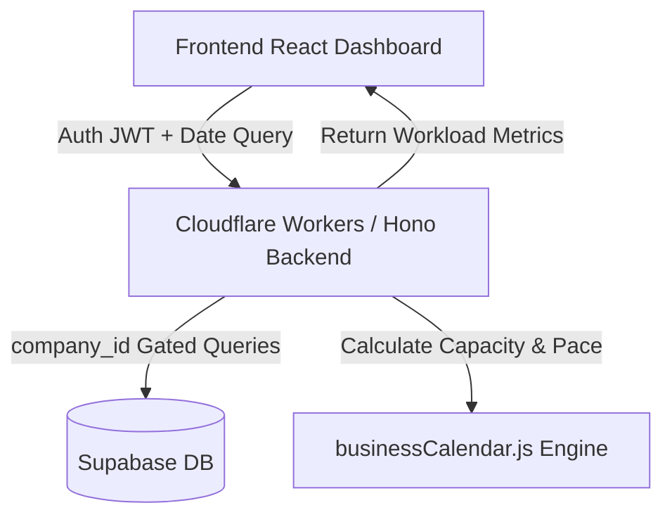

# FMS — Workload Management Module Solution Document

This document provides a comprehensive technical overview and walkthrough of the **Workload Management Module** implemented for the Flow Management System (FMS). This module enables Process Controllers and Administrators to monitor daily workload, daily capacity, occupancy percentages, and task pace signals for every active team member on any selected day.

---

## 1. Context & Architectural Overview

The Workload Management Module is a management-exclusive analytics tool. It solves the visibility gap for Process Controllers who need to quickly determine:
- Who has too much work assigned?
- Who is free or underutilized?
- Are team members on track to complete their tasks before daily deadlines?

### Access Control & Gating (Security)
* **Gated Access**: The module is visible and accessible only to **Administrators (Admin)**, **Process Controllers (Controller)**, and **Interim Managers** (members acting with controller permissions).
* **Worker Dashboard Gating**: To maintain clear roles, team members (regular workers) **cannot** see their own or others' occupancy status, pace signals, or behind/ahead indicators. No workload UI elements are exposed to the member dashboard.
* **Multi-Tenant Scoping**: All database queries are strictly scoped using the authenticated user's `company_id` retrieved directly from the validated JWT token. This prevents cross-tenant data leakage.

### System Diagram


---

## 2. Calculation Rules & Definitions

All workload tracking calculations operate in **minutes** and use the `estimated_minutes` field (estimated effort for a task) rather than SLA/turnaround SLAs.

### A. Daily Capacity
Daily capacity represents the total working minutes available for a company's team member on the target date.
* **Calculation**: Computed using `calculateWorkingMinutes(start, end, companySettings, holidays)` in the backend working-hours engine:
  $$\text{Daily Capacity} = (\text{Work End Time} - \text{Work Start Time}) - \text{Lunch Break} - \text{Non-Working Segments}$$
* **Parameters**: 
  - Standard work hours: `09:30 - 18:30` (9 hours) minus a 1-hour lunch break (`13:30 - 14:30`) yields **480 working minutes** (8 hours).
  - Weekend or company holiday: Capacity is set to `0` and the day is flagged as a **non-working day**.

### B. Assigned Today
The total planned load for the day, which does not shrink even if the worker starts late.
* **Formula**:
  $$\text{Assigned Today} = \sum \text{estimated\_minutes (all assigned tasks for target day)}$$
* **Scope**: Sum of all tasks assigned to the member (`assigned_user_id = member.id`) where the `due_date` falls within the target day (from `00:00:00+05:30` to `23:59:59.999+05:30`), counting:
  1. **Workflow Tasks** (generated from instances, where `instance_id` is set).
  2. **Manual Tasks** (added directly, where `is_manual = true`).

### C. Completed Today
Subset of assigned tasks that are completed or approved on the target day.
* **Allocated Minutes**: Sum of `estimated_minutes` of completed tasks.
* **Actual Minutes**: Sum of `total_working_minutes` from task performance logs.
* **Reconciliation**: Completed Minutes + Remaining Minutes = Assigned Minutes.

### D. Remaining
The sum of estimated minutes for assigned-today tasks not yet completed (statuses: `LOCKED`, `IN_PROGRESS`, `REJECTED`, `PENDING_APPROVAL`).
* **Formula**:
  $$\text{Remaining} = \sum \text{estimated\_minutes (incomplete tasks due today)}$$

### E. Occupancy Percentage
Indicates the level of workload assigned relative to the worker's capacity for the day.
* **Formula**:
  $$\text{Occupancy \%} = \frac{\text{Assigned Today}}{\text{Daily Capacity}} \times 100$$
* **Overload**: May exceed 100% (e.g., 125%) to signal overload. If capacity is 0 (weekend/holiday), occupancy is set to `null`.

### F. Smart Pace Status (Pace Signal)
A real-time pace signal computed against the remaining capacity left in the working day.
* **Remaining Capacity From Now**: Computed using `calculateWorkingMinutes(now, endOfWorkday, company, holidays)`.
* **Rules & Priority**:
  1. **`NO_LOAD`**: Target day capacity is `0` OR the member has `0` assigned minutes today.
  2. **`DELAYED`**: Any incomplete task is past its due date (`due_date < referenceTime`).
  3. **`BEHIND`**: $\text{Remaining Minutes} > \text{Remaining Capacity From Now}$ (the worker cannot complete the remaining work in the remaining hours).
  4. **`AHEAD`**: $\text{Remaining Minutes} \le \text{Remaining Capacity From Now} \times 0.8$ (has a 20% time buffer).
  5. **`ON_TIME`**: Default state if the remaining work fits exactly within the remaining capacity.

---

## 3. Code Modifications (Implementation Details)

### Backend (Cloudflare Workers + Hono)
1. **[performance.routes.js](file:///c:/Users/shash/Downloads/Dev-task-june-2026/backend/src/modules/performance/performance.routes.js)**:
   - Added routes for the workload endpoints:
     - `GET /performance/workload-summary` — Controller/Admin team overview.
     - `GET /performance/workload-member/:userId` — Deep dive into a single member's tasks and variance records.
   - Protected both routes using the `authenticate` middleware.
2. **[performance.controller.js](file:///c:/Users/shash/Downloads/Dev-task-june-2026/backend/src/modules/performance/performance.controller.js)**:
   - Implemented standard IST time calculations using Asia/Kolkata timezone helpers.
   - Built the `getWorkloadSummary` and `getWorkloadMemberDetail` functions utilizing the existing `calculateWorkingMinutes` engine.
   - Handled historical snapshots (past dates) and future dates (no delayed checks, full capacity available) gracefully:
     - *Past dates*: Uses `referenceTime = endOfWorkday` to check historical compliance.
     - *Future dates*: Skips the overdue check (`referenceTime = null`).
     - *Today*: Uses `referenceTime = new Date()` (real wall-clock time) for live pacing status.
   - Handled task sorting: `DELAYED` → `BEHIND` → `highest occupancy` → `ON_TIME` → `AHEAD` → `NO_LOAD`.

### Frontend (Next.js)
1. **[workload.ts (API client)](file:///c:/Users/shash/Downloads/Dev-task-june-2026/frontend/src/lib/api/workload.ts)**:
   - Created type definitions (`WorkloadStatus`, `WorkloadSummaryResponse`, `WorkloadMemberDetail`, etc.).
   - Integrated API endpoints using the default Axios wrapper to query backend endpoints.
2. **[WorkloadManagementTab.tsx](file:///c:/Users/shash/Downloads/Dev-task-june-2026/frontend/src/components/workload/WorkloadManagementTab.tsx)**:
   - Designed a comprehensive team overview dashboard featuring aggregate metrics (Total members, Avg occupancy, overloaded count, delayed count).
   - Added quick date selectors (Yesterday, Today, Tomorrow) alongside a custom date picker.
   - Included color-coded status badges and occupancy bars (green $\le 80\%$, yellow $80-100\%$, orange $100-130\%$, red $> 130\%$).
   - Built a per-member drill-down view listing:
     - Complete task lists with Type (Workflow vs. Manual), Status, Estimated effort, and Actual completion time.
     - Completion History panel highlighting estimated vs. actual variances and individual task efficiency.
3. **Sidebar Gating ([sidebar.tsx](file:///c:/Users/shash/Downloads/Dev-task-june-2026/frontend/src/components/shared-components/sidebar/sidebar.tsx))**:
   - Registered the new navigation link (`Workload`) under the controller panel.
   - Secured the link by enforcing role checks: `user.platform_role === 'controller'` or `user.workflow_role === 'interim_manager'`.
   - Admin Tab registry is updated in **[admin/page.tsx](file:///c:/Users/shash/Downloads/Dev-task-june-2026/frontend/src/app/dashboard/admin/page.tsx)**.

---

## 4. Setup and Verification Guide

### Database Seeding
To test the module with realistic and live workload tracking scenarios, run the custom workload seeding script.

1. Ensure your backend has the `.dev.vars` file properly populated with the correct Supabase parameters:
   ```env
   SUPABASE_URL=your_supabase_project_url
   SUPABASE_SERVICE_ROLE_KEY=your_service_role_key
   ```
2. Navigate to the backend directory and execute the seeding command:
   ```powershell
   node scripts/seed-workload.js
   ```
   *(Optional: You can specify a custom date to seed, e.g., `node scripts/seed-workload.js 2026-06-22`)*

This script cleans up previous runs and sets up 5 key worker profiles with realistic workloads for the target day:
* **Priya Nair (Copywriter)**: Overloaded (~137% occupancy) with a mix of completed, in-progress, pending, and rejected tasks.
* **Rahul Verma (Designer)**: On-track (~75% occupancy).
* **Sara Khan (Reviewer)**: Ahead (~25% occupancy).
* **Amit Joshi (Marketer)**: Delayed (has an incomplete task past its due time).
* **Member User**: Has a combination of manual and workflow-assigned tasks.

### Manual Verification Matrix

Perform the following manual testing checklist to verify system compliance:

| Step | Action | Expected Output | Checked |
| :--- | :--- | :--- | :---: |
| **1** | Log in as a Process Controller (`controller@example.com`) or Admin. | "Workload" tab is visible in the sidebar navigation. | [x] |
| **2** | Select Today's date on the Workload tab. | Summary metrics and member cards display according to seeded values. Priya is Overloaded (orange/red), Amit is Delayed (red). | [x] |
| **3** | Click on Priya Nair to drill down. | Detail card shows 660 mins assigned today. Task list displays both manual and workflow tasks. Completion history shows actual vs. allocated minutes. | [x] |
| **4** | Select a custom date that is a weekend (e.g. Saturday). | "Non-working day" banner appears. Capacity reads `0`. Occupancy reads `No Load`. | [x] |
| **5** | Log in as a standard member (e.g. `member@example.com`). | Confirm that the "Workload" tab is completely hidden from the sidebar and cannot be navigated to. | [x] |

---
*Document prepared for FMS Developer Assignment grading.*
